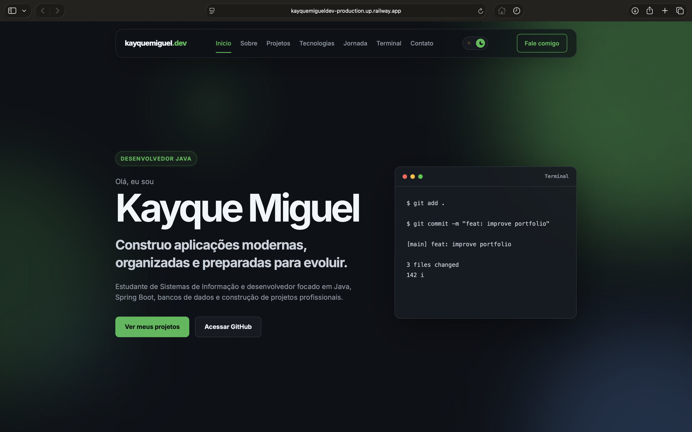
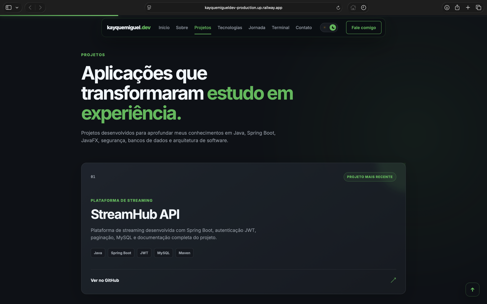
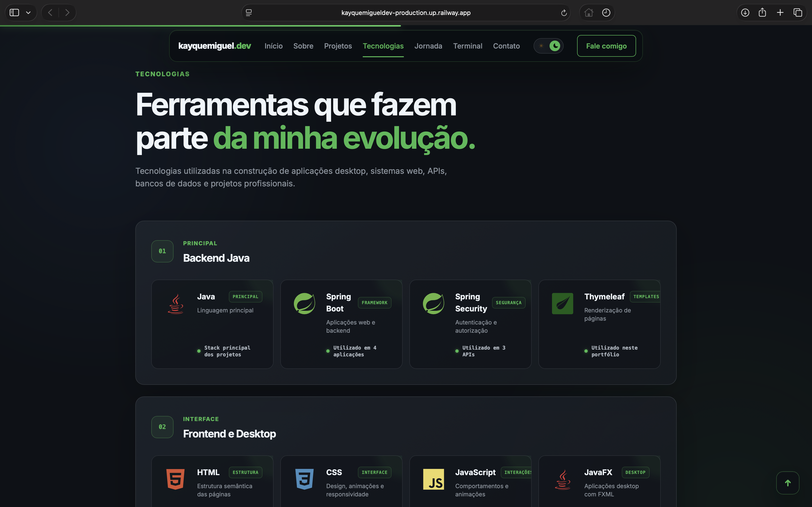
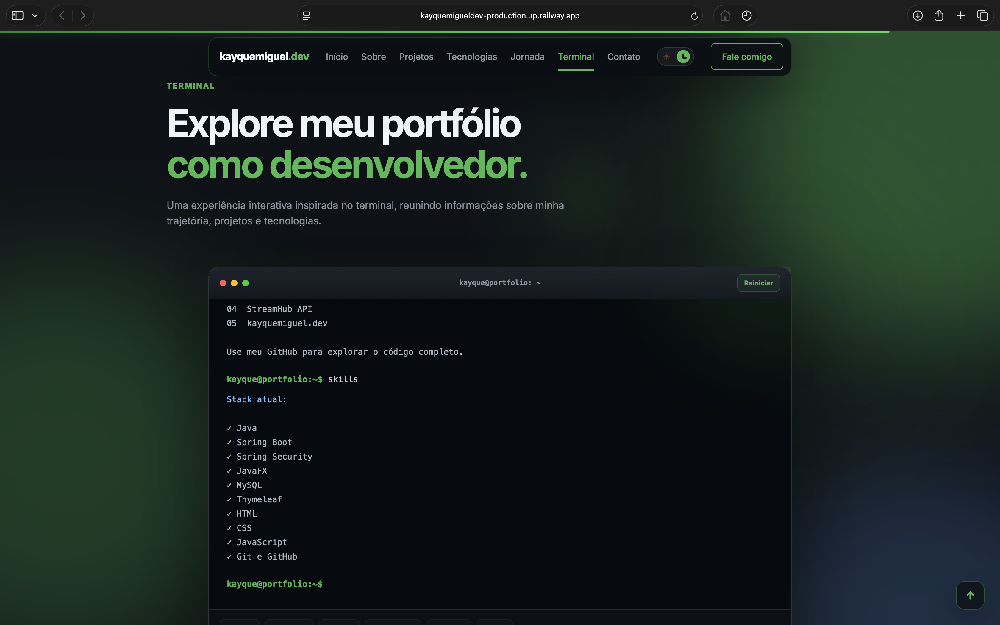
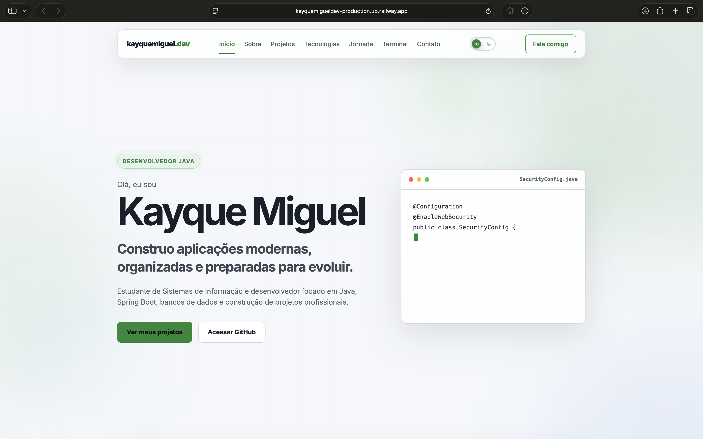
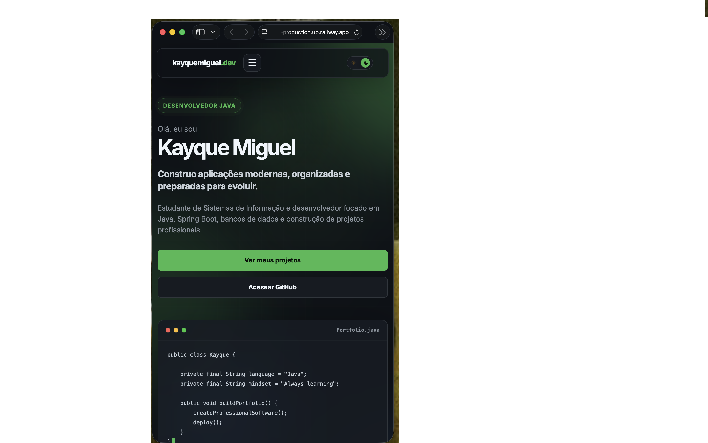

<div align="center">

# kayquemiguel.dev

### Portfólio profissional desenvolvido com Java, Spring Boot e Thymeleaf

Uma aplicação web criada para apresentar minha trajetória, projetos, tecnologias e evolução como desenvolvedor.

[](https://www.java.com/)
[](https://spring.io/projects/spring-boot)
[](https://www.thymeleaf.org/)
[](https://maven.apache.org/)
[](https://railway.com/)

<br>

[🌐 Acessar portfólio](https://kayquemigueldev-production.up.railway.app)
&nbsp;&nbsp;•&nbsp;&nbsp;
[💻 Ver repositório](https://github.com/kayquemigueldev/kayquemiguel.dev)

</div>

---

## Sobre o projeto

O **kayquemiguel.dev** é meu portfólio profissional e também um projeto de estudo completo.

A aplicação foi construída com Spring Boot e Thymeleaf, reunindo backend Java, desenvolvimento web, animações, responsividade, SEO e deploy em nuvem.

Mais do que uma página estática, o projeto representa minha evolução como desenvolvedor e centraliza os principais projetos que construí durante meus estudos.

---

## Preview

<div align="center">



</div>

---

## Funcionalidades

- Apresentação profissional e resumo da trajetória
- Seção de disponibilidade para oportunidades
- Exibição dos principais projetos
- Tecnologias organizadas por categoria
- Logos reais das tecnologias com Devicon
- Linha do tempo da evolução nos estudos
- Terminal interativo com comandos personalizados
- Tema claro e escuro com preferência persistente
- Menu responsivo para dispositivos móveis
- Animações de entrada durante a rolagem
- Background animado com efeito aurora
- Editor de código com animação de digitação
- Barra de progresso da página
- Botão flutuante para voltar ao topo
- Microinterações e feedback visual nos botões
- SEO com Open Graph, Twitter Cards e Schema.org
- `robots.txt`, `sitemap.xml` e Web Manifest
- Deploy automatizado pela Railway

---

## Tecnologias

### Backend

- Java 21
- Spring Boot
- Spring MVC
- Thymeleaf
- Maven

### Frontend

- HTML5
- CSS3
- JavaScript
- Devicon

### Infraestrutura e ferramentas

- Git
- GitHub
- Railway
- IntelliJ IDEA

---

## Screenshots

### Projetos



### Tecnologias



### Terminal interativo



### Tema claro



### Versão mobile



---

## Estrutura do projeto

```text
src
└── main
    ├── java
    │   └── com.kayque.portfolio
    │       ├── controller
    │       │   └── HomeController.java
    │       └── PortfolioApplication.java
    │
    └── resources
        ├── static
        │   ├── css
        │   │   └── style.css
        │   ├── images
        │   │   └── preview.png
        │   ├── js
        │   │   └── script.js
        │   ├── favicon.svg
        │   ├── robots.txt
        │   ├── sitemap.xml
        │   └── site.webmanifest
        │
        ├── templates
        │   └── index.html
        │
        └── application.properties

```
---

# ▶ Como executar localmente

## Pré-requisitos

Antes de começar, instale:

- Java 21
- Git

O projeto utiliza Maven Wrapper, portanto não é necessário instalar o Maven separadamente.

## Clonar o repositório

```bash
git clone https://github.com/kayquemigueldev/kayquemiguel.dev.git
```

## Entrar na pasta

```bash
cd kayquemiguel.dev
```

## Executar a aplicação

### macOS / Linux

```bash
./mvnw spring-boot:run
```

### Windows

```bash
mvnw.cmd spring-boot:run
```

Depois acesse:

```text
http://localhost:8080
```

---

# Gerar o build de produção

```bash
./mvnw clean package
```

Depois execute:

```bash
java -jar target/*.jar
```

---

# Deploy

O projeto está publicado na Railway.

A aplicação utiliza a porta fornecida pelo ambiente de produção:

```properties
server.port=${PORT:8080}
```

Assim, continua utilizando a porta **8080** localmente e adapta-se automaticamente durante o deploy.

### Aplicação publicada

```
https://kayquemigueldev-production.up.railway.app
```

---

# SEO

A V1 inclui:

- Meta Description
- Canonical URL
- Open Graph
- Twitter Cards
- Schema.org
- robots.txt
- sitemap.xml
- favicon
- Web Manifest
- Imagem para compartilhamento

Essas configurações ajudam mecanismos de busca e plataformas sociais a compreender e apresentar corretamente o portfólio.

---

# Aprendizados

Durante o desenvolvimento deste projeto aprofundei conhecimentos em:

- Spring Boot
- Spring MVC
- Thymeleaf
- HTML5
- CSS3
- JavaScript
- Responsividade
- SEO
- Deploy na Railway
- Maven
- Git
- GitHub
- Organização de projetos
- UI/UX
- Animações
- Microinterações
- Dark / Light Mode

---

# Roadmap

## V1

- [x] Landing Page
- [x] Hero Section
- [x] Sobre
- [x] Projetos
- [x] Tecnologias
- [x] Jornada
- [x] Terminal interativo
- [x] Tema Dark / Light
- [x] SEO
- [x] Deploy
- [x] Responsividade

## V2

- [ ] Painel administrativo
- [ ] Projetos carregados do banco de dados
- [ ] Integração com GitHub
- [ ] Currículo para download
- [ ] Analytics
- [ ] Internacionalização
- [ ] Domínio personalizado

---

# Autor

Desenvolvido por **Kayque Miguel**.

GitHub:
https://github.com/kayquemigueldev

Portfólio:
https://kayquemigueldev-production.up.railway.app

